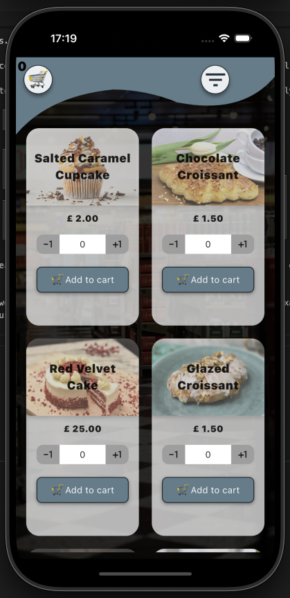
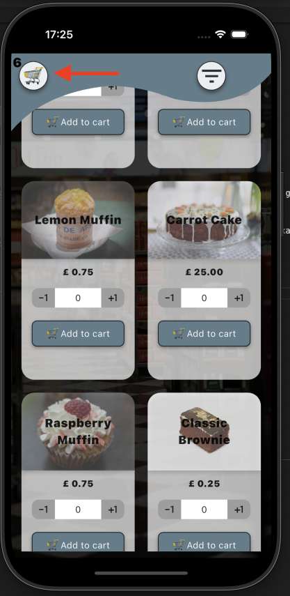
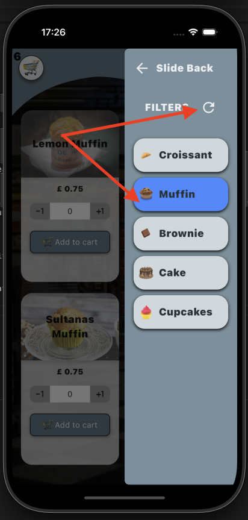
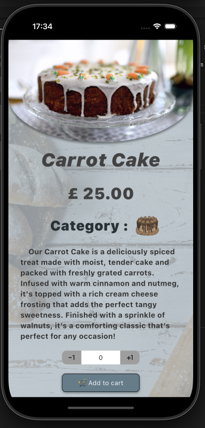
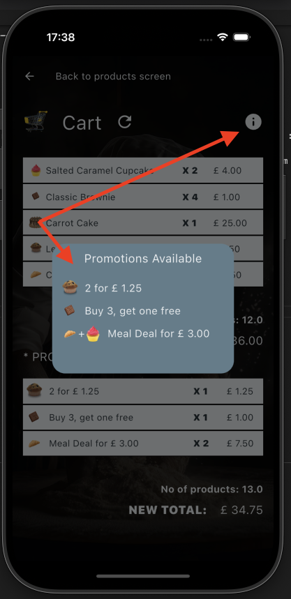
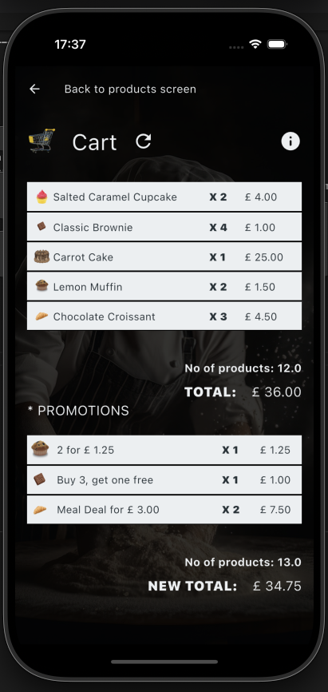

# Checkout Application as a test for Fluro
  
# Requirements: 

Implement the code for a supermarket checkout that calculates the total price of several items.

 Design and implement a UI for the project too, demonstrating your creativity while also showcasing your skills in state management and architecture. In a normal supermarket, items are identified by ‘stock keeping units’ or ‘SKUs’.
 
  In our store, we will use individual letters of the alphabet, A, B, C etc, as the SKUs. Our goods are priced individually. 
  In addition, some items have promotions of any of the following types: 
    •  Multipriced: buy n of them and which will cost you y. For example, item A might cost 50 pence individually but this week we have a special offer where you can buy 3 As for £1.30. 
    •  Buy n get 1 free 
    •  Meal deal: buy different items together and get a special price. For instance, items D and E might cost 150 and 200 pence each individually but this week we have a special offer where you can buy one of each for just £3.

    This week’s prices are the following: 
    Item   Unit Price (in pence)    Special Price
     A      50   
     B      75                       2 for £1.25 
     C      25                       Buy 3, get one free 
     D      150                      Buy D and E for £3 
     E      200                      Buy D and E for £3

# Project Presented:

- Created a json with all the products (jsonDataProducts.json) which sits in assets. (Reason for creating this is to demonstrate capabilities of getting data from an API call) -> which is done in Repository->json_repository.dart
- Used PageRouteBuilder for routes around the app (Routes-> routes_configuration.dart)
- As a state management I opted for a simple yet very efficient way by combining the power of streams with RxDart and dependOnInheritedWidgetOfExactType from flutter SDK inheritedwidget.It can be used in the UI by calling StreamBuilder or we can listen to the streams in various files.

 ## Landing Page: 
 -list of all products (productImage,productTitle,productPrice and capability of adding to cart) 

   
------------------------------------------------------------------------------------------------

 -top left we have cart that is being updated real time and with number of products

  
 ------------------------------------------------------------------------------------------------

- top right button will open the filters from right
 ->can choose filters to update the product list or can reset them 

  
 ------------------------------------------------------------------------------------------------

 - adding to cart -> you can choose what product and the number of products to add to cart. This is independent from the cart itself which means : 
     -> after you add the product the middle number will reset and not show what is already in cart 
     -> if in the cart you have a product X 5 you can update from the list with what number you want and will update (0 means will dissapear from cart)
     -> you cannot add 0 to cart if the product doesnt already exists in there

 ## Product Page:
 -  productImage,productTitle,productPrice and capability of adding to cart -> (same as product list)   

 

 ## Cart Page : 

 - you can see the promotions available 

- on upper part of the cart we can see the products that were added  : 
       -> product title then number of products and total price for that row 
       -> we can also see the total number of products and total price 

- on lower part of the cart we can see if any promotions has been applied : 
       -> we can see the promotions applied (title ) -> how many times has been applied and total price for those products in the promotion 
       -> we can also see the total number of products and total price (which may be different from the original cart)  
                                                         
